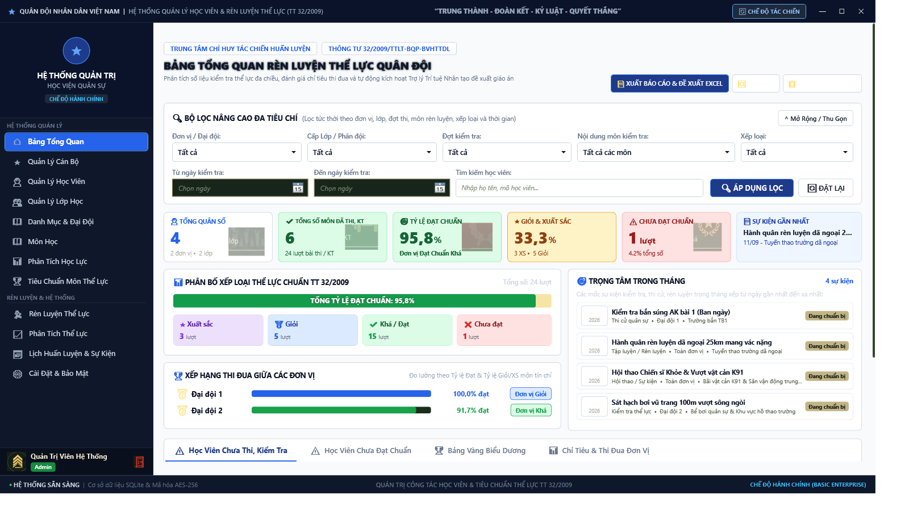
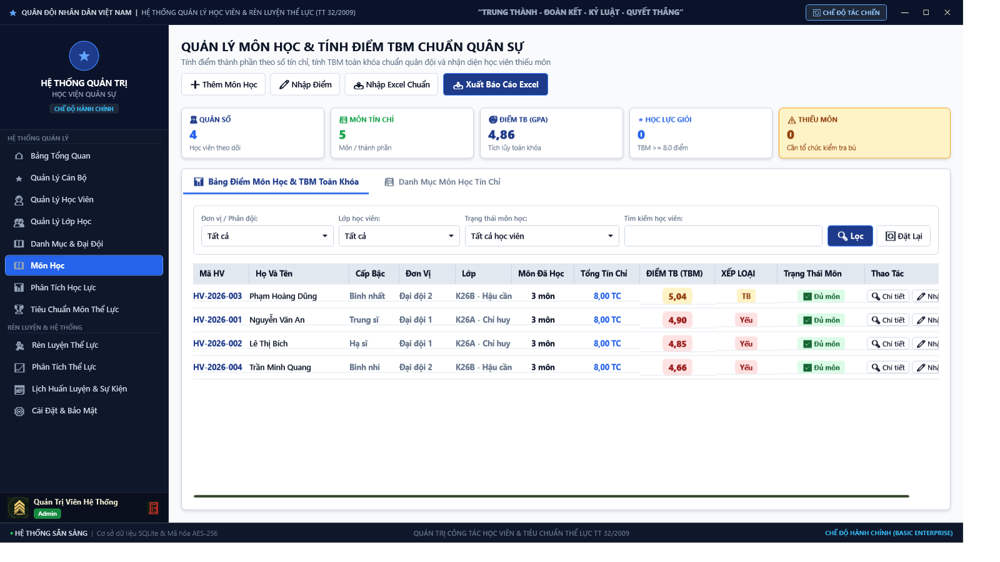
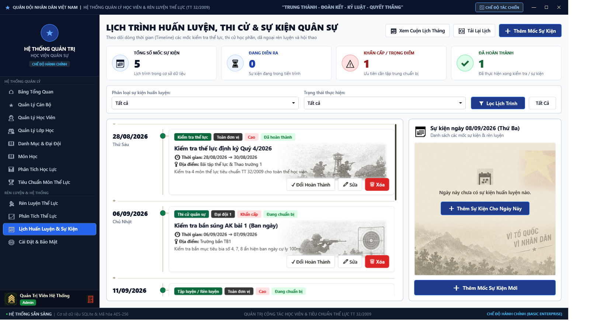
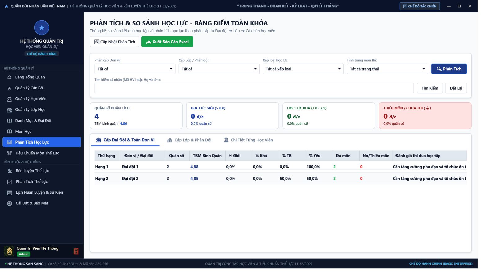
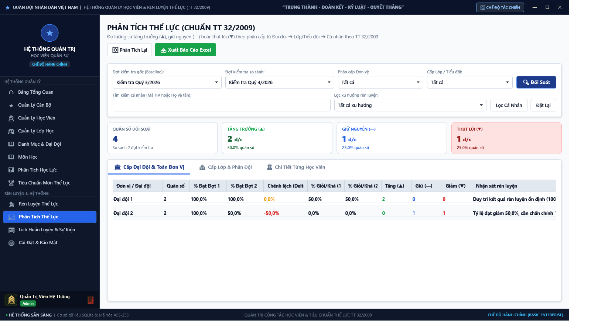
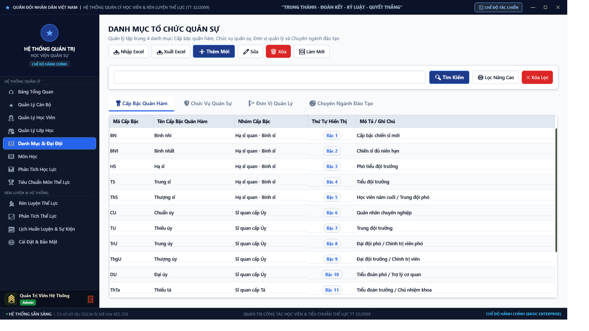
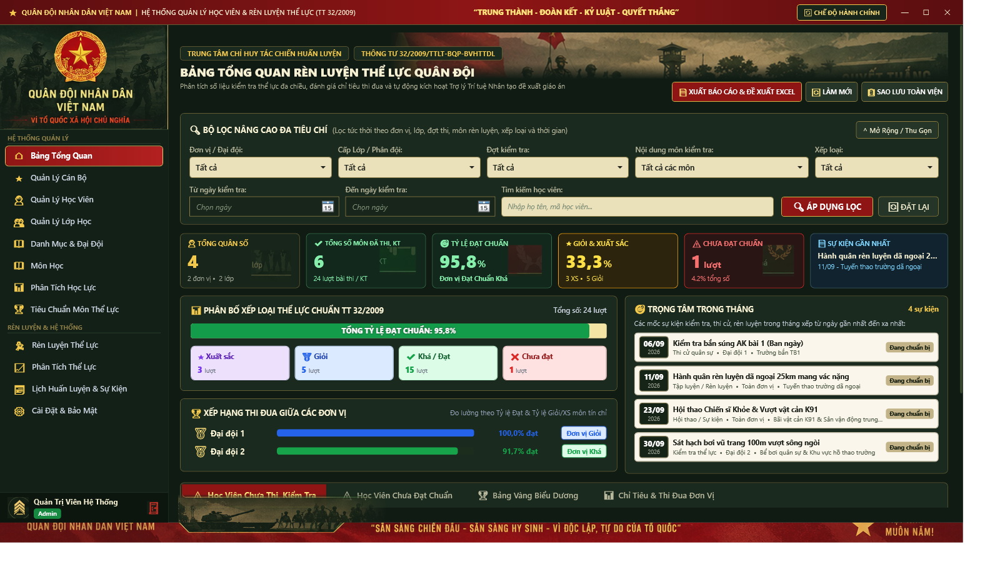
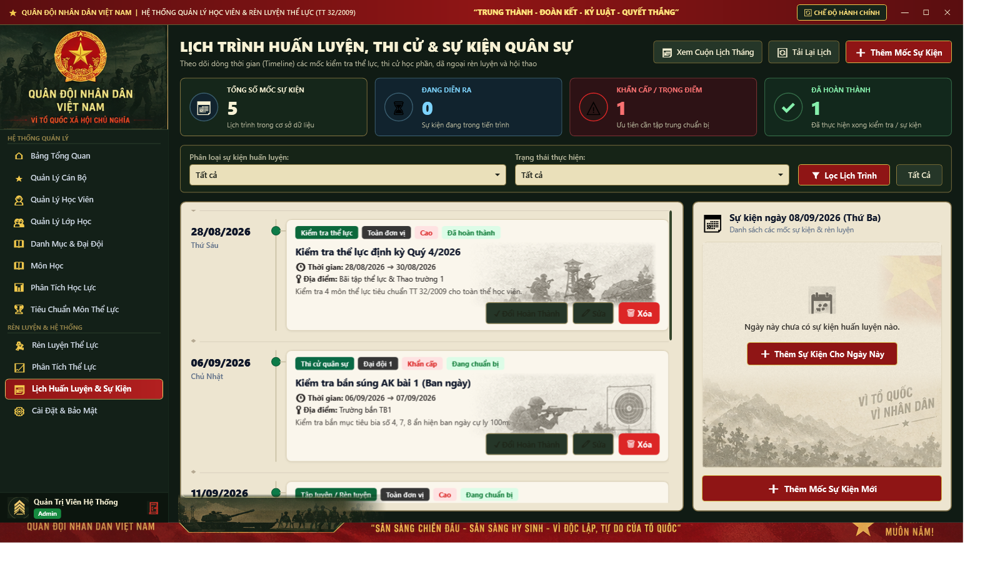

# 🎖️ HỆ THỐNG QUẢN LÝ HỌC VIÊN QUÂN SỰ (QL_HocVien)
### *Military Academy Cadet Management System — Chuẩn Thông tư 32/2009/TTLT-BQP-BVHTTDL & Quy chế Tín chỉ Quân sự*

<p align="center">
  
</p>

<p align="center">
  <a href="https://github.com/NguyenTan33/QL_HocVien/releases/latest"></a>
  <a href="https://dotnet.microsoft.com/download/dotnet/8.0"></a>
  <a href="https://www.zetetic.net/sqlcipher/"></a>
  <a href="https://github.com/NguyenTan33/QL_HocVien/actions"></a>
  <a href="https://www.microsoft.com/windows"></a>
  <a href="LICENSE"></a>
</p>

---

## 📌 MỤC LỤC
- [Tổng Quan Hệ Thống](#-tổng-quan-hệ-thống)
- [Tính Năng Đột Phá](#-tính-năng-đột-phá)
- [Showcase Giao Diện Thực Tế](#-showcase-giao-diện-thực-tế)
  - [1. Chế Độ Hành Chính (Administrative Mode)](#1-chế-độ-hành-chính-administrative-mode)
  - [2. Chế Độ Tác Chiến (Combat Tactical Mode)](#2-chế-độ-tác-chiến-combat-tactical-mode)
- [Tiêu Chuẩn Quân Sự & Nghiệp Vụ Đào Tạo](#-tiêu-chuẩn-quân-sự--nghiệp-vụ-đào-tạo)
  - [Chuẩn Thể Lực TT 32/2009/TTLT-BQP-BVHTTDL](#chuẩn-thể-lực-tt-322009ttlt-bqp-bvhttdl)
  - [Hệ Thống Điểm Tín Chỉ & Xếp Loại](#hệ-thống-điểm-tín-chỉ--xếp-loại)
- [Kiến Trúc Bảo Mật Cấp Quân Sự](#-kiến-trúc-bảo-mật-cấp-quân-sự)
- [Hướng Dẫn Cài Đặt & Sử Dụng](#-hướng-dẫn-cài-đặt--sử-dụng)
  - [Tải và Chạy Ứng Dụng (Portable 1 File)](#tải-và-chạy-ứng-dụng-portable-1-file)
  - [Tài Khoản Đăng Nhập Mặc Định](#tài-khoản-đăng-nhập-mặc-định)
  - [Khóa Bảo Mật Cấp 2 (Security Gate Passkeys)](#khóa-bảo-mật-cấp-2-security-gate-passkeys)
- [Hướng Dẫn Biên Dịch Từ Mã Nguồn (Developer Guide)](#-hướng-dẫn-biên-dịch-từ-mã-nguồn-developer-guide)
- [Cấu Trúc Thư Mục Dự Án](#-cấu-trúc-thư-mục-dự-án)
- [Ngăn Xếp Công Nghệ (Tech Stack)](#-ngăn-xếp-công-nghệ-tech-stack)
- [Tác Giả & Bản Quyền](#-tác-giả--bản-quyền)

---

## 📖 TỔNG QUAN HỆ THỐNG

**QL_HocVien** là giải pháp phần mềm chuyên biệt chuẩn hóa công tác quản trị học viên, cán bộ quản lý và kết quả huấn luyện - đào tạo tại các học viện, nhà trường quân đội. Phần mềm được xây dựng trên nền tảng công nghệ hiện đại **.NET 8.0 WPF**, tuân thủ nghiêm ngặt các quy chuẩn văn thư quốc phòng và an toàn thông tin quân sự:

- **100% Offline-First & Self-Contained:** Vận hành hoàn toàn độc lập, không yêu cầu kết nối Internet khi tác nghiệp thực địa, toàn bộ thư viện đóng gói trong một file thực thi duy nhất (`Single-file executable`).
- **Chuẩn hóa Thông tư liên tịch 32/2009/TTLT-BQP-BVHTTDL:** Tự động hóa đánh giá và xếp loại tiêu chuẩn rèn luyện thể lực quân nhân theo độ tuổi và giới tính.
- **Quy chế Đào tạo Tín chỉ Học viện:** Tính toán điểm trung bình học kỳ, điểm tích lũy thang 10 & thang 4, hỗ trợ thi nâng điểm, học lại và xét điều kiện tốt nghiệp sĩ quan.
- **Engine Giao diện Kép Độc lập (Dual-Theme Engine):** Tách biệt rạch ròi giữa Chế độ Hành chính (trang nhã, chuẩn mực văn phòng) và Chế độ Tác chiến (Dark Tactical Camo, tối ưu hiển thị ban đêm & thao trường).

---

## ⚡ TÍNH NĂNG ĐỘT PHÁ

| # | Nhóm tính năng | Mô tả chi tiết |
|:---:|---|---|
| **1** | 🌓 **Dual-Theme Engine** | Chuyển đổi linh hoạt giữa **Chế độ Hành chính** (White/Corporate Blue chuẩn nhận diện công vụ) và **Chế độ Tác chiến** (Dark Military Green, viền Neon Tactical, giảm mỏi mắt ban đêm). |
| **2** | 🎖️ **Thể Lực Quân Sự TT 32** | Tự động chấm điểm 4 môn tiêu chuẩn: Chạy 100m, Xà đơn (hoặc Chống đẩy), Bơi ếch 100m, Hành quân mang vác nặng / Chạy vũ trang 3000m. Xếp loại: Giỏi, Khá, Đạt, Không Đạt. |
| **3** | 📊 **TBM Tín Chỉ & Học Lực** | Tính điểm TBM học kỳ, TBM tích lũy theo trọng số tín chỉ. Tự động quy đổi thang 10 $\leftrightarrow$ thang 4 $\leftrightarrow$ điểm chữ (A, B, C, D, F). Phân loại học lực Xuất sắc, Giỏi, Khá, TB, Yếu. |
| **4** | 📅 **Interactive Military Timeline** | Quản lý lịch huấn luyện, diễn tập, bắn đạn thật, báo động hành quân, sinh hoạt chi bộ theo dòng thời gian tương tác trực quan với bộ lọc đa cấp (Tiểu đoàn / Đại đội / Loại sự kiện). |
| **5** | 🛡️ **Bảo Mật Đa Tầng SQLCipher** | Toàn bộ cơ sở dữ liệu SQLite được mã hóa bằng thuật toán **AES-256 bit CBC**. Khóa mã hóa sinh động kết hợp bảo vệ phần cứng máy tính chủ (Windows DPAPI + Machine Binding). |
| **6** | 🔐 **Security Gate Passkey** | Cơ chế xác thực cấp 2 khi can thiệp vào các hoạt động trọng yếu (chỉnh sửa bảng điểm chính thức, phê duyệt danh sách tốt nghiệp, phân quyền tài khoản). |
| **7** | 🛑 **Anti Brute-Force Lockout** | Tự động kích hoạt cơ chế khóa tài khoản lũy tiến theo cấp số nhân khi phát hiện đăng nhập sai liên tiếp vượt ngưỡng cảnh báo (ngăn chặn dò quét mật khẩu). |
| **8** | 📑 **Excel 14 Sheets ClosedXML** | Hỗ trợ nhập (Import) và xuất (Export) báo cáo mẫu biểu quân sự 14 Sheets chuẩn quy định, bảo toàn định dạng cột, tiêu đề, công thức và màu sắc. |
| **9** | 🔄 **Auto-Update GitHub Release** | Tích hợp cơ chế kiểm tra phiên bản mới từ GitHub Releases qua API `version.json`, tự động thông báo Changelog và tải bản cập nhật an toàn. |

---

## 📸 SHOWCASE GIAO DIỆN THỰC TẾ

### 1. Chế Độ Hành Chính (Administrative Mode)
*Giao diện nền sáng chuẩn mực, đường nét sắc sảo, tối ưu cho công tác văn thư, tổng hợp báo cáo và quản lý học vụ tại cơ quan.*

<table>
  <tr>
    <td width="50%">
      <p align="center"><b>📊 Bảng Điều Khiển Tổng Quan (Dashboard)</b></p>
      
      <p align="center"><i>Thống kê quân số, phân bố học lực, tiến độ rèn luyện theo thời gian thực</i></p>
    </td>
    <td width="50%">
      <p align="center"><b>🏅 Bảng Điểm Tín Chỉ & Xếp Loại</b></p>
      
      <p align="center"><i>Tính toán TBM tích lũy, quy đổi thang điểm 4, cảnh báo học vụ tự động</i></p>
    </td>
  </tr>
  <tr>
    <td width="50%">
      <p align="center"><b>📅 Dòng Thời Gian Huấn Luyện (Timeline)</b></p>
      
      <p align="center"><i>Lịch công tác tuần, kế hoạch diễn tập, bắn đạn thật và sinh hoạt Đảng</i></p>
    </td>
    <td width="50%">
      <p align="center"><b>🏃 Rèn Luyện Thể Lực (Thông Tư 32)</b></p>
      
      <p align="center"><i>Tra chuẩn 4 môn chiến sĩ khỏe tự động theo lứa tuổi và phân loại kết quả</i></p>
    </td>
  </tr>
  <tr>
    <td width="50%">
      <p align="center"><b>📝 Quản Lý Kỳ Thi & Đợt Đánh Giá</b></p>
      
      <p align="center"><i>Lập lịch thi, phân công giám thị, nhập điểm phúc tra và khóa sổ điểm</i></p>
    </td>
    <td width="50%">
      <p align="center"><b>🗂️ Danh Mục Quân Sự Tập Trung</b></p>
      
      <p align="center"><i>Quản trị biên chế đơn vị (Tiểu đoàn, Đại đội), cấp bậc quân hàm, môn học</i></p>
    </td>
  </tr>
</table>

---

### 2. Chế Độ Tác Chiến (Combat Tactical Mode)
*Giao diện nền tối quân sự Dark Military Canvas kết hợp đường viền Neon Tactical, giảm độ chói lóa, tối ưu vận hành ban đêm hoặc ngoài thao trường huấn luyện.*

<table>
  <tr>
    <td width="50%">
      <p align="center"><b>🎯 Dashboard Chỉ Huy Tác Chiến</b></p>
      
      <p align="center"><i>Theo dõi sẵn sàng chiến đấu, quân số thực tế và báo động kiểm tra</i></p>
    </td>
    <td width="50%">
      <p align="center"><b>⏱️ Lịch Tác Chiến & Báo Động Diễn Tập</b></p>
      
      <p align="center"><i>Timeline trực quan theo dõi tiến độ hành quân dã ngoại, bắn đạn thật</i></p>
    </td>
  </tr>
</table>

---

## 🎖️ TIÊU CHUẨN QUÂN SỰ & NGHIỆP VỤ ĐÀO TẠO

### Chuẩn Thể Lực TT 32/2009/TTLT-BQP-BVHTTDL
Hệ thống tích hợp thuật toán đối soát tự động tiêu chuẩn rèn luyện thể lực cán bộ, chiến sĩ, học viên theo Thông tư liên tịch số 32/2009/TTLT-BQP-BVHTTDL:
- **Nội dung 1: Chạy 100m** — Đánh giá tốc độ và sức bật của học viên.
- **Nội dung 2: Xà đơn** — Co tay xà đơn (hoặc chống đẩy trên xà kép) đánh giá sức bền nhóm cơ thân trên.
- **Nội dung 3: Bơi ếch 100m** — Kiểm tra kỹ năng vận động dưới nước trong điều kiện trang bị nhẹ.
- **Nội dung 4: Chạy vũ trang 3000m / Hành quân mang vác nặng** — Sức bền ý chí và thể lực dẻo dai cấp phân đội.

```
Tiêu chuẩn phân nhóm tuổi:
├── Nhóm 1: Dưới 27 tuổi
├── Nhóm 2: Từ 27 đến 35 tuổi
├── Nhóm 3: Từ 36 đến 45 tuổi
└── Nhóm 4: Trên 45 tuổi
```

### Hệ Thống Điểm Tín Chỉ & Xếp Loại
Tuân thủ Quy chế đào tạo đại học, cao đẳng hệ chính quy theo học chế tín chỉ quân sự:
- **Điểm học phần:** Kết hợp giữa Điểm chuyên cần (10%), Điểm kiểm tra thường xuyên (30%) và Điểm thi kết thúc học phần (60%).
- **Điểm trung bình chung tích lũy (TBM):**

$$\text{TBM} = \frac{\sum_{i=1}^{n} (\text{Điểm}_{i} \times \text{Số tín chỉ}_{i})}{\sum_{i=1}^{n} \text{Số tín chỉ}_{i}}$$

- **Bảng quy đổi thang điểm:**
  - **A (8.5 - 10.0)** $\rightarrow$ 4.0 (Xuất sắc / Giỏi)
  - **B (7.0 - 8.4)** $\rightarrow$ 3.0 (Khá)
  - **C (5.5 - 6.9)** $\rightarrow$ 2.0 (Trung bình)
  - **D (4.0 - 5.4)** $\rightarrow$ 1.0 (Trung bình yếu)
  - **F (< 4.0)** $\rightarrow$ 0.0 (Không đạt — Phải học lại)

---

## 🔒 KIẾN TRÚC BẢO MẬT CẤP QUÂN SỰ

```
                          ┌───────────────────────────┐
                          │   XÁC THỰC NGƯỜI DÙNG     │
                          │   BCrypt (Work Factor 11) │
                          └─────────────┬─────────────┘
                                        │
                                        ▼
                          ┌───────────────────────────┐
                          │    SECURITY GATE CẤP 2    │
                          │   Passkey phê duyệt điểm  │
                          └─────────────┬─────────────┘
                                        │
                                        ▼
    ┌───────────────────────────────────────────────────────────────────┐
    │                 CSDL SQLite ĐƯỢC MÃ HÓA TOÀN PHẦN                 │
    │                 SQLCipher v2.1.8 — Thuật toán AES-256             │
    │  Dynamic Key: DPAPI Protected Data + Hardware CPU Binding String  │
    └───────────────────────────────────────────────────────────────────┘
```

1. **Mã hóa CSDL AES-256 bit:** Toàn bộ file dữ liệu được bảo vệ bằng SQLCipher. Nếu tệp tin bị sao chép trái phép ra khỏi thiết bị được cấp phép, dữ liệu hoàn toàn không thể đọc được.
2. **Khóa liên kết thiết bị cứng (Hardware Binding):** Chuỗi khóa giải mã được dẫn xuất từ định danh bo mạch chủ và vi xử lý thông qua `System.Management`, kết hợp bảo vệ qua `Windows DPAPI`.
3. **Mã hóa mật khẩu BCrypt:** Chống lại các cuộc tấn công Rainbow Table và GPU Cracking với muối ngẫu nhiên độ dài an toàn cao.
4. **Cơ chế chống Brute-force:** Khi người dùng nhập sai mật khẩu 5 lần, tài khoản bị tạm khóa 60 giây. Sau mỗi lần tiếp theo, thời gian khóa tăng gấp đôi ($2^n$).

---

## 🚀 HƯỚNG DẪN CÀI ĐẶT & SỬ DỤNG

### Tải và Chạy Ứng Dụng (Portable 1 File)
1. Truy cập trang [GitHub Releases](https://github.com/NguyenTan33/QL_HocVien/releases/latest).
2. Tải về tệp thực thi duy nhất **`QL_HocVien.exe`**.
3. Chạy trực tiếp mà **không cần cài đặt thêm .NET SDK hoặc .NET Runtime** (ứng dụng đã tích hợp sẵn runtime).

### Tài Khoản Đăng Nhập Mặc Định
Sau khi khởi tạo CSDL lần đầu, hệ thống tạo sẵn các tài khoản sau:

| Phân Quyền | Tên Đăng Nhập | Mật Khẩu Mặc Định | Vai Trò & Giới Hạn Quyền |
|---|---|---|---|
| **Chỉ Huy / Quản Trị Viên** | `admin` | `Admin@123` | Toàn quyền hệ thống, danh mục quân sự, quản trị người dùng, sao lưu & phục hồi CSDL. |
| **Cán Bộ Quản Lý** | `canbo01` | `Canbo@123` | Quản lý hồ sơ học viên, nhập điểm tín chỉ, chấm điểm thể lực, lập lịch công tác. |

> ⚠️ **Khuyến nghị bảo mật:** Đổi mật khẩu ngay sau lần đăng nhập đầu tiên tại menu *Thông tin cá nhân*.

### Khóa Bảo Mật Cấp 2 (Security Gate Passkeys)
Khi thực hiện các thao tác quan trọng (như sửa điểm đã chốt sổ hoặc xóa học viên), hệ thống sẽ yêu cầu nhập Passkey xác thực. Các mã Passkey mặc định được cấp:
- `QD-2026-HQ88-K01A`
- `QD-2026-TL32-B02C`
- `QD-2026-QS99-D03E`

---

## 🛠️ HƯỚNG DẪN BIÊN DỊCH TỪ MÃ NGUỒN (DEVELOPER GUIDE)

### Yêu Cầu Môi Trường
- **Hệ điều hành:** Windows 10/11 x64 (Bản build 19041 trở lên)
- **SDK:** [.NET 8.0 SDK (x64)](https://dotnet.microsoft.com/download/dotnet/8.0)
- **Công cụ khuyến nghị:** Visual Studio 2022 (với gói *.NET Desktop Development*) hoặc JetBrains Rider / VS Code.

### Các Bước Biên Dịch & Chạy

1. **Clone mã nguồn từ GitHub:**
   ```bash
   git clone https://github.com/NguyenTan33/QL_HocVien.git
   cd QL_HocVien
   ```

2. **Khôi phục các gói thư viện NuGet:**
   ```bash
   dotnet restore
   ```

3. **Chạy toàn bộ 104 bài kiểm thử đơn vị (Unit Tests):**
   ```bash
   dotnet test QL_HocVien.Tests/QL_HocVien.Tests.csproj
   ```
   *Kết quả mong đợi: `Passed! - Failed: 0, Passed: 104, Skipped: 0, Total: 104`*

4. **Khởi chạy ứng dụng ở chế độ Debug:**
   ```bash
   dotnet run --project QL_HocVien.csproj
   ```

5. **Đóng gói xuất bản file duy nhất (Self-Contained Single File):**
   ```bash
   dotnet publish QL_HocVien.csproj -c Release -r win-x64 --self-contained true -p:PublishSingleFile=true -p:IncludeNativeLibrariesForSelfExtract=true -p:EnableCompressionInSingleFile=true -o ./publish
   ```
   *File thực thi hoàn chỉnh `QL_HocVien.exe` sẽ được tạo trong thư mục `./publish`.*

---

## 📂 CẤU TRÚC THƯ MỤC DỰ ÁN

```
QL_HocVien/
├── Assets/                    # Biểu tượng, icon SVG và tài nguyên hình ảnh
├── Commands/                  # RelayCommand & AsyncRelayCommand triển khai MVVM
├── Data/                      # SQLite DbContext & Cấu hình mã hóa SQLCipher
├── docs/                      # Tài liệu hệ thống & hình ảnh chụp màn hình
│   └── screenshots/           # Ảnh chụp giao diện thực tế (Admin & Combat)
├── Helpers/                   # Bộ chuyển đổi màu sắc, Converter định dạng dữ liệu
├── Models/                    # Thực thể dữ liệu (HocVien, CanBo, Diem, TheLuc, MonHoc...)
├── Resources/                 # Biểu tượng ứng dụng (.ico, .png), hình nền đăng nhập
├── Services/                  # Nghiệp vụ: Bảo mật, Tính điểm, Nhập xuất Excel, Update
│   ├── ExcelExportService.cs  # Xử lý xuất báo cáo 14 sheets ClosedXML
│   ├── SecurityGateService.cs # Quản lý khóa Passkey cấp 2
│   ├── UpdateService.cs       # Kiểm tra cập nhật GitHub Releases
│   └── ...
├── ViewModels/                # Trình điều khiển ViewModels (CommunityToolkit.Mvvm)
│   ├── DashboardViewModel.cs  # Thống kê phân tích số liệu trực quan
│   ├── CreditScoreViewModel.cs# Xử lý tính điểm tín chỉ & xếp loại
│   ├── TimelineViewModel.cs   # Quản lý dòng thời gian huấn luyện
│   └── ...
├── Views/                     # Giao diện XAML (Window, UserControl, Dialog)
├── QL_HocVien.Tests/          # Bộ 104 Unit Tests kiểm thử tự động toàn diện
├── appsettings.json           # Cấu hình chuỗi kết nối và tham số ứng dụng
├── version.json               # Phiên bản phát hành & liên kết cập nhật
└── QL_HocVien.csproj          # Tệp cấu hình dự án .NET 8.0 WPF
```

---

## 💻 NGĂN XẾP CÔNG NGHỆ (TECH STACK)

| Lớp | Công Nghệ / Thư Viện | Mục Đích Sử Dụng |
|---|---|---|
| **Framework** | `.NET 8.0 Windows (WPF)` | Xây dựng ứng dụng Desktop hiệu năng cao, giao diện mượt mà |
| **Kiến Trúc UI** | `MVVM Pattern` | Phân tách rạch ròi giữa View, ViewModel và Model |
| **MVVM Toolkit** | `CommunityToolkit.Mvvm 8.4.2` | Triển khai `ObservableObject`, `RelayCommand` gọn gàng, hiệu quả |
| **Cơ Sở Dữ Liệu** | `SQLite with SQLCipher (AES-256)` | Lưu trữ dữ liệu an toàn, mã hóa toàn phần ở cấp độ file |
| **ORM** | `Entity Framework Core 8.0.8` | Quản lý truy vấn dữ liệu theo phương pháp Code-First / DbContext |
| **Mã Hóa Mật Khẩu** | `BCrypt.Net-Next 4.2.0` | Băm mật khẩu người dùng với salt an toàn |
| **Bảo Vệ Khóa** | `DPAPI & System.Management` | Sinh khóa mã hóa CSDL ràng buộc phần cứng thiết bị |
| **Báo Cáo Excel** | `ClosedXML 0.105.1` | Đọc / Ghi file Excel 14 Sheets nhanh chóng không cần cài MS Excel |
| **Thư Điện Tử** | `MailKit 4.17.0` | Gửi cảnh báo tự động và thông báo báo cáo qua Email |
| **Kiểm Thử** | `xUnit & Moq` | 104 bài kiểm thử tự động đảm bảo độ tin cậy tuyệt đối |

---

## 📜 TÁC GIẢ & BẢN QUYỀN

- **Tác giả phát triển:** [Nguyễn Tấn (NguyenTan33)](https://github.com/NguyenTan33)
- **Repository chính thức:** [https://github.com/NguyenTan33/QL_HocVien](https://github.com/NguyenTan33/QL_HocVien)
- **Bản quyền phát hành:** © 2026 Dự án Quản lý Học viên Quân sự. Toàn quyền được bảo lưu.

<p align="center">
  <i>⭐ Đừng quên bấm <b>Star</b> trên GitHub nếu dự án hữu ích đối với công tác và học tập của bạn! ⭐</i>
</p>
